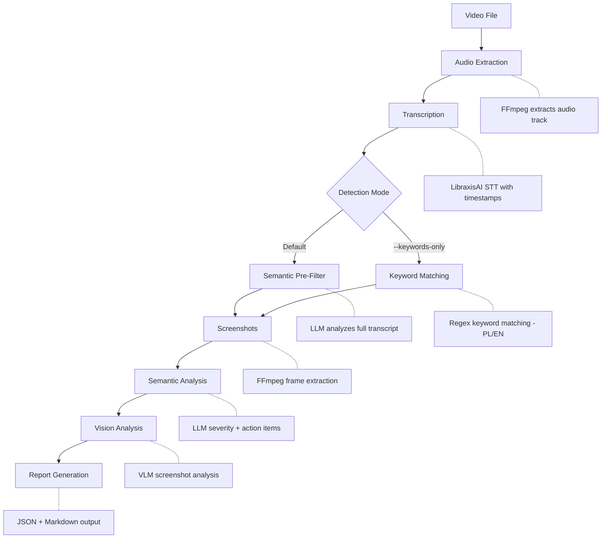

# ⌜ ScreenScribe ⌟

**AI-powered screenrecordings review automation for screencast commentary analysis.**
**Transform your voice descriptions on the code issues and extract the actionable findings for AI agents**

## Overview
ScreenScribe extracts actionable insights from screencast recordings by transcribing audio commentary, detecting mentions of bugs, changes, and UI issues, capturing relevant screenshots, and generating comprehensive reports with AI-powered semantic analysis.


> **Status:** v0.1.3 — Unified VLM pipeline + Multi-provider support + Batch mode.

## API Provider

ScreenScribe uses **LibraxisAI API** by default, but is **fully compatible with any provider supporting the Responses API** (OpenAI, Anthropic, etc.).

### Multi-Provider Setup (Recommended)

Use different providers for different tasks — e.g., LibraxisAI for cheaper STT, OpenAI for VLM:

```env
# ~/.config/screenscribe/config.env

# Per-endpoint API keys (hybrid setup)
LIBRAXIS_API_KEY=vista-xxx              # → STT (cheaper transcription)
OPENAI_API_KEY=sk-proj-xxx              # → VLM (unified analysis)

# Explicit endpoints (full URLs - recommended)
SCREENSCRIBE_STT_ENDPOINT=https://api.libraxis.cloud/v1/audio/transcriptions
SCREENSCRIBE_LLM_ENDPOINT=https://api.openai.com/v1/responses
SCREENSCRIBE_VISION_ENDPOINT=https://api.openai.com/v1/responses

# Models
SCREENSCRIBE_STT_MODEL=whisper-1
SCREENSCRIBE_LLM_MODEL=gpt-4o
SCREENSCRIBE_VISION_MODEL=gpt-4o
```

> **Note:** All analysis uses the Responses API with `previous_response_id` for conversation chaining. Context persists across findings AND across videos in batch mode.

## Features

- **Unified VLM Pipeline**: Single VLM call analyzes screenshot + full transcript together (~45% faster than separate LLM+VLM)
- **Batch Mode**: Process multiple videos with shared context — VLM remembers findings across videos
- **Multi-Provider Support**: Per-endpoint API keys (e.g., LibraxisAI for STT, OpenAI for VLM)
- **Semantic Pre-Filtering**: LLM analyzes the entire transcript before frame extraction
- **Sentiment Detection**: Understands negations and context - distinguishes real issues from confirmations
- **Audio Extraction**: Automatically extracts audio from video files (MOV, MP4, etc.) using FFmpeg
- **Audio Quality Validation**: Detects silent recordings and warns about missing microphone input
- **Speech-to-Text**: Transcribes audio with word-level timestamps via LibraxisAI STT API
- **Issue Detection**: Identifies bugs, change requests, and UI issues (semantic + keyword-based)
- **Custom Keywords**: Define your own detection keywords via YAML configuration
- **Screenshot Capture**: Extracts frames at timestamps where issues are mentioned
- **Response Chaining**: Context persists via Responses API `previous_response_id` — across findings AND videos
- **Model Validation**: Fail-fast validation of STT/LLM/Vision availability before pipeline starts
- **AI-Optimized Reports**: JSON output designed for efficient AI agent consumption with structured action items
- **Report Generation**: Creates JSON and Markdown reports with executive summaries
- **Resumable Pipeline**: Checkpoint system allows resuming interrupted processing
- **Graceful Degradation**: Best-effort processing - errors don't stop the pipeline
- **Retry Logic**: Automatic retry with exponential backoff for API resilience
- **i18n Support**: Prompts adapt to selected language (Polish, English)
- **Dry Run Mode**: Preview what would be processed before committing
- **Time Estimates**: Get processing time estimates before starting

## Tech Stack

| Component | Technology | Purpose |
|-----------|------------|---------|
| CLI Framework | [Typer](https://typer.tiangolo.com/) | Modern, type-hinted CLI |
| HTTP Client | [httpx](https://www.python-httpx.org/) | Async-ready, long timeout support |
| Terminal UI | [Rich](https://rich.readthedocs.io/) | Progress bars, panels, tables |
| Media Processing | FFmpeg / FFprobe | Audio extraction, frame capture |
| AI Backend | LibraxisAI API | STT, LLM, Vision models |
| Package Manager | [uv](https://docs.astral.sh/uv/) | Fast, modern Python packaging |

## Installation

### Prerequisites

- Python 3.11+
- [uv](https://docs.astral.sh/uv/) package manager
- FFmpeg (for audio/video processing)
- LibraxisAI API key

### Install FFmpeg

```bash
# macOS
brew install ffmpeg

# Ubuntu/Debian
sudo apt install ffmpeg

# Windows (via chocolatey)
choco install ffmpeg
```

### Install ScreenScribe

```bash
# Clone the repository
git clone https://github.com/LibraxisAI/screenscribe.git
cd screenscribe

# Install globally using uv (recommended)
make install

# Or manually:
uv tool install .

# Verify installation
screenscribe version
```

### Configure API Key

```bash
# Initialize config and set API key
screenscribe config --init
screenscribe config --set-key YOUR_LIBRAXIS_API_KEY

# Or manually edit ~/.config/screenscribe/config.env
```

## Quick Start

```bash
# Full analysis (default: semantic pre-filtering for comprehensive detection)
screenscribe review path/to/video.mov

# Fast mode: keyword-based detection only (no LLM pre-filter)
screenscribe review video.mov --keywords-only

# See time estimate before processing
screenscribe review video.mov --estimate

# Dry run: transcribe + detect only (no AI, no screenshots)
screenscribe review video.mov --dry-run

# Output to specific directory
screenscribe review video.mov -o ./my-review

# Skip vision analysis (faster)
screenscribe review video.mov --no-vision

# Resume interrupted processing
screenscribe review video.mov --resume

# Use custom keywords
screenscribe review video.mov --keywords-file my_keywords.yaml

# English language (affects transcription + AI prompts)
screenscribe review video.mov --lang en

# Transcription only
screenscribe transcribe video.mov -o transcript.txt
```

## How It Works



### Detection Modes

| Mode | Flag | Description |
|------|------|-------------|
| **Semantic** (default) | — | LLM analyzes entire transcript before frame extraction. Finds more issues, including those without explicit keywords. |
| **Keywords** | `--keywords-only` | Fast regex-based detection using predefined keyword patterns. Lower API costs, faster processing. |

## Output Structure

```
video_review/
├── transcript.txt      # Full transcription
├── report.json         # Machine-readable report
├── report.md           # Human-readable Markdown
└── screenshots/
    ├── 01_bug_01-23.jpg
    ├── 02_change_02-45.jpg
    └── ...
```

## Report Contents

Each report includes:

- **Executive Summary**: AI-generated overview of key issues and priorities
- **Statistics**: Breakdown by category (bugs, changes, UI) and severity
- **Detailed Findings**: For each detected issue:
  - Timestamp and category
  - Original transcript text
  - Context (surrounding dialogue)
  - AI Analysis:
    - **Issue detection** (`is_issue`: true/false) - distinguishes real problems from confirmations
    - **Sentiment** (problem/positive/neutral) - tone of user's statement
    - Severity rating (critical/high/medium/low/none)
    - Summary
    - Affected components
    - Action items
    - Suggested fix
  - Screenshot

## Configuration

Config file location: `~/.config/screenscribe/config.env`

```env
# API Key (pick one)
SCREENSCRIBE_API_KEY=your-api-key
# OPENAI_API_KEY=sk-proj-xxx
# LIBRAXIS_API_KEY=xxx

# Explicit Endpoints (full URLs - recommended)
SCREENSCRIBE_STT_ENDPOINT=https://api.openai.com/v1/audio/transcriptions
SCREENSCRIBE_LLM_ENDPOINT=https://api.openai.com/v1/responses
SCREENSCRIBE_VISION_ENDPOINT=https://api.openai.com/v1/responses

# Alternative: Base URL (auto-derives /v1/... paths)
# SCREENSCRIBE_API_BASE=https://api.libraxis.cloud

# Models
SCREENSCRIBE_STT_MODEL=whisper-1
SCREENSCRIBE_LLM_MODEL=gpt-4o
SCREENSCRIBE_VISION_MODEL=gpt-4o

# Processing Options
SCREENSCRIBE_LANGUAGE=pl
SCREENSCRIBE_SEMANTIC=true
SCREENSCRIBE_VISION=true
```

## CLI Reference

### `screenscribe review`

Full video analysis pipeline.

```bash
screenscribe review VIDEO [OPTIONS]

Options:
  -o, --output PATH         Output directory (default: VIDEO_review/)
  -l, --lang TEXT           Language code for transcription and AI prompts (default: pl)
  -k, --keywords-file PATH  Custom keywords YAML file
  --keywords-only           Use fast keyword-based detection instead of semantic pre-filter
  --local                   Use local STT server instead of cloud
  --semantic/--no-semantic  Enable/disable LLM analysis (default: enabled)
  --vision/--no-vision      Enable/disable vision analysis (default: enabled)
  --json/--no-json          Save JSON report (default: enabled)
  --markdown/--no-markdown  Save Markdown report (default: enabled)
  --resume                  Resume from previous checkpoint if available
  --estimate                Show time estimate without processing
  --dry-run                 Run transcription and detection only, then stop
```

### `screenscribe transcribe`

Transcription only, without analysis.

```bash
screenscribe transcribe VIDEO [OPTIONS]

Options:
  -o, --output PATH       Output file for transcript
  -l, --lang TEXT         Language code (default: pl)
  --local                 Use local STT server
```

### `screenscribe config`

Manage configuration.

```bash
screenscribe config [OPTIONS]

Options:
  --show                  Show current configuration
  --init                  Create default config file
  --init-keywords         Create keywords.yaml for customization
  --set-key TEXT          Set API key in config
```

### `screenscribe version`

Show version information.

## Detected Keywords

ScreenScribe detects issues based on keywords in both Polish and English:

**Bugs**: bug, błąd, nie działa, crash, error, broken, failed, exception...

**Changes**: zmiana, zmienić, poprawić, update, modify, refactor, rename...

**UI Issues**: UI, interfejs, wygląd, layout, design, button, margin, padding...

### Custom Keywords

Create a custom keywords file for your project:

```bash
# Generate default keywords.yaml
screenscribe config --init-keywords

# Or use with review command
screenscribe review video.mov --keywords-file my_keywords.yaml
```

Keywords file format (YAML):

```yaml
bug:
  - "nie działa"
  - "broken"
  - "crash"
change:
  - "trzeba zmienić"
  - "should fix"
ui:
  - "button"
  - "layout"
```

ScreenScribe automatically searches for `keywords.yaml` in the current directory.

## Performance

Typical processing times for a 15-minute video:

| Step | Duration |
|------|----------|
| Audio extraction | ~5s |
| Transcription | ~30s |
| Issue detection | <1s |
| Screenshot extraction | ~10s |
| Semantic analysis (44 issues) | ~8-10 min |
| Vision analysis (optional) | ~20+ min |

## Development

```bash
# Clone and setup
git clone https://github.com/LibraxisAI/screenscribe.git
cd screenscribe
make dev

# Run from source
uv run screenscribe review video.mov

# Quality checks
make lint       # ruff check
make typecheck  # mypy
make check      # all quality checks

# Testing
make test              # unit tests (fast, no API needed)
make test-integration  # integration tests (requires LIBRAXIS_API_KEY)
make test-all          # all tests

# Formatting
make format     # ruff format + fix
```

### Makefile Targets

```
make install          # uv tool install . (global CLI)
make dev              # Install dev dependencies
make test             # Run unit tests
make test-integration # Run integration tests (requires API key)
make lint             # Run ruff linter
make format           # Format code with ruff
make typecheck        # Run mypy type checker
make check            # All quality checks
make clean            # Remove caches and artifacts
```

## Architecture

```
screenscribe/
├── __init__.py            # Version info
├── cli.py                 # Typer CLI interface
├── config.py              # Configuration management (per-endpoint keys)
├── audio.py               # FFmpeg audio extraction
├── transcribe.py          # LibraxisAI STT integration
├── detect.py              # Keyword-based issue detection
├── semantic_filter.py     # Semantic pre-filtering pipeline
├── keywords.py            # Custom keywords loading (YAML)
├── screenshots.py         # Frame extraction
├── unified_analysis.py    # Unified VLM pipeline (replaces semantic+vision)
├── image_utils.py         # Shared image encoding utilities
├── semantic.py            # LLM semantic analysis (legacy)
├── vision.py              # Vision model analysis (legacy)
├── report.py              # Report generation (JSON/Markdown)
├── prompts.py             # i18n prompt templates (PL/EN)
├── api_utils.py           # Retry logic, API utilities
├── checkpoint.py          # Pipeline checkpointing
├── validation.py          # Model availability validation (fail-fast)
└── default_keywords.yaml  # Default detection keywords

tests/
├── test_detect.py         # Detection unit tests
├── test_semantic_filter.py # Semantic filter unit tests (54 tests)
├── test_validation.py     # Validation unit tests
└── test_integration.py    # API integration tests
```

## API Integration

ScreenScribe uses LibraxisAI's unified API:

- **STT**: `POST /v1/audio/transcriptions` (OpenAI-compatible)
- **LLM**: `POST /v1/responses` (Responses API format)
- **Vision**: `POST /v1/responses` with `input_image` (auto-routed to VLM)

## Code Quality

| Tool | Purpose | Config |
|------|---------|--------|
| **mypy** | Type checking | Strict mode enabled |
| **Ruff** | Linting + formatting | E, W, F, I, B, C4, UP, S, RUF rules |
| **Bandit** | Security linting | Pre-commit hook |
| **Semgrep** | Static analysis | Pre-commit hook |
| **detect-secrets** | Secret detection | Baseline tracking |

All code is fully type-hinted and passes strict mypy checks.

## Roadmap

### Implemented ✓

- [x] Audio extraction (FFmpeg)
- [x] Transcription (LibraxisAI STT API)
- [x] Issue detection (keyword-based, PL/EN)
- [x] Screenshot extraction (single + batch)
- [x] Semantic analysis (LLM)
- [x] Vision analysis (VLM)
- [x] Report generation (JSON + Markdown)
- [x] Configuration management (.env, env vars)
- [x] CLI with 4 commands
- [x] Pre-commit hooks
- [x] Type hints (mypy strict)
- [x] Custom keyword configuration (YAML)
- [x] Progress save/resume (checkpointing)
- [x] Retry logic with exponential backoff
- [x] i18n prompts (PL/EN)
- [x] Test suite (pytest)
- [x] Sentiment detection (is_issue, sentiment fields)
- [x] Audio quality validation (silent recording detection)
- [x] Model availability validation (fail-fast)
- [x] Response API chaining (vision context from semantic)
- [x] AI-optimized report format

### Planned

- [ ] Local model support for LLM/Vision
- [ ] Batch processing / queue system
- [ ] More languages for prompts
- [ ] Web UI

### Known Limitations

- Vision analysis can be slow (~20+ min for many issues)

## License

MIT License

---

**Made with (งಠ_ಠ)ง by the ⌜ ScreenScribe ⌟ 𝖙𝖊𝖆𝖒 (c) 2025
Maciej & Monika + Klaudiusz (AI) + Mixerka (AI)**
