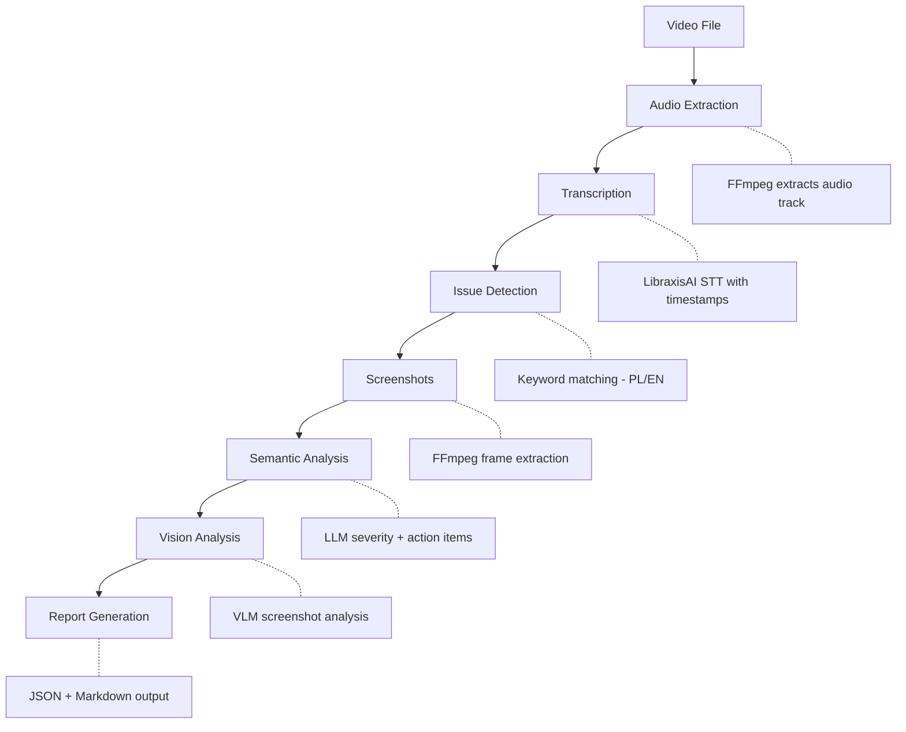

# ⌜ ScreenScribe ⌟

**Video review automation for screencast commentary analysis.**

ScreenScribe extracts actionable insights from screencast recordings by transcribing audio commentary, detecting mentions of bugs, changes, and UI issues, capturing relevant screenshots, and generating comprehensive reports with AI-powered semantic analysis.

> **Status:** v0.1.0 — Fully functional CLI with AI-powered analysis. Production-ready for single-video workflows.

## Features

- **Audio Extraction**: Automatically extracts audio from video files (MOV, MP4, etc.) using FFmpeg
- **Speech-to-Text**: Transcribes audio with word-level timestamps via LibraxisAI STT API
- **Issue Detection**: Identifies bugs, change requests, and UI issues from Polish and English keywords
- **Screenshot Capture**: Extracts frames at timestamps where issues are mentioned
- **Semantic Analysis**: Uses LLM to analyze each finding, assign severity, and suggest fixes
- **Vision Analysis**: Optional screenshot analysis using vision-capable models
- **Report Generation**: Creates JSON and Markdown reports with executive summaries

## Tech Stack

| Component | Technology | Purpose |
|-----------|------------|---------|
| CLI Framework | [Typer](https://typer.tiangolo.com/) | Modern, type-hinted CLI |
| HTTP Client | [httpx](https://www.python-httpx.org/) | Async-ready, long timeout support |
| Terminal UI | [Rich](https://rich.readthedocs.io/) | Progress bars, panels, tables |
| Media Processing | FFmpeg / FFprobe | Audio extraction, frame capture |
| AI Backend | LibraxisAI API | STT, LLM, Vision models |
| Package Manager | [uv](https://docs.astral.sh/uv/) | Fast, modern Python packaging |

## Installation

### Prerequisites

- Python 3.11+
- [uv](https://docs.astral.sh/uv/) package manager
- FFmpeg (for audio/video processing)
- LibraxisAI API key

### Install FFmpeg

```bash
# macOS
brew install ffmpeg

# Ubuntu/Debian
sudo apt install ffmpeg

# Windows (via chocolatey)
choco install ffmpeg
```

### Install ScreenScribe

```bash
# Clone the repository
git clone https://github.com/LibraxisAI/screenscribe.git
cd screenscribe

# Install globally using uv
uv tool install .

# Verify installation
screenscribe version
```

### Configure API Key

```bash
# Initialize config and set API key
screenscribe config --init
screenscribe config --set-key YOUR_LIBRAXIS_API_KEY

# Or manually edit ~/.config/screenscribe/config.env
```

## Quick Start

```bash
# Full analysis of a screencast video
screenscribe review path/to/video.mov

# Output to specific directory
screenscribe review video.mov -o ./my-review

# Skip vision analysis (faster)
screenscribe review video.mov --no-vision

# Transcription only
screenscribe transcribe video.mov -o transcript.txt
```

## How It Works



## Output Structure

```
video_review/
├── transcript.txt      # Full transcription
├── report.json         # Machine-readable report
├── report.md           # Human-readable Markdown
└── screenshots/
    ├── 01_bug_01-23.jpg
    ├── 02_change_02-45.jpg
    └── ...
```

## Report Contents

Each report includes:

- **Executive Summary**: AI-generated overview of key issues and priorities
- **Statistics**: Breakdown by category (bugs, changes, UI) and severity
- **Detailed Findings**: For each detected issue:
  - Timestamp and category
  - Original transcript text
  - Context (surrounding dialogue)
  - AI Analysis:
    - Severity rating (critical/high/medium/low)
    - Summary
    - Affected components
    - Action items
    - Suggested fix
  - Screenshot

## Configuration

Config file location: `~/.config/screenscribe/config.env`

```env
# API Configuration
LIBRAXIS_API_KEY=your-api-key-here
LIBRAXIS_API_BASE=https://api.libraxis.cloud

# Models
SCREENSCRIBE_STT_MODEL=whisper-1
SCREENSCRIBE_LLM_MODEL=ai-suggestions
SCREENSCRIBE_VISION_MODEL=ai-suggestions

# Processing Options
SCREENSCRIBE_LANGUAGE=pl
SCREENSCRIBE_SEMANTIC=true
SCREENSCRIBE_VISION=true
```

## CLI Reference

### `screenscribe review`

Full video analysis pipeline.

```bash
screenscribe review VIDEO [OPTIONS]

Options:
  -o, --output PATH       Output directory (default: VIDEO_review/)
  -l, --lang TEXT         Language code for transcription (default: pl)
  --local                 Use local STT server instead of cloud
  --semantic/--no-semantic  Enable/disable LLM analysis (default: enabled)
  --vision/--no-vision    Enable/disable vision analysis (default: enabled)
  --json/--no-json        Save JSON report (default: enabled)
  --markdown/--no-markdown  Save Markdown report (default: enabled)
```

### `screenscribe transcribe`

Transcription only, without analysis.

```bash
screenscribe transcribe VIDEO [OPTIONS]

Options:
  -o, --output PATH       Output file for transcript
  -l, --lang TEXT         Language code (default: pl)
  --local                 Use local STT server
```

### `screenscribe config`

Manage configuration.

```bash
screenscribe config [OPTIONS]

Options:
  --show                  Show current configuration
  --init                  Create default config file
  --set-key TEXT          Set API key in config
```

### `screenscribe version`

Show version information.

## Detected Keywords

ScreenScribe detects issues based on keywords in both Polish and English:

**Bugs**: bug, błąd, nie działa, crash, error, broken, failed, exception...

**Changes**: zmiana, zmienić, poprawić, update, modify, refactor, rename...

**UI Issues**: UI, interfejs, wygląd, layout, design, button, margin, padding...

## Performance

Typical processing times for a 15-minute video:

| Step | Duration |
|------|----------|
| Audio extraction | ~5s |
| Transcription | ~30s |
| Issue detection | <1s |
| Screenshot extraction | ~10s |
| Semantic analysis (44 issues) | ~8-10 min |
| Vision analysis (optional) | ~20+ min |

## Development

```bash
# Clone and setup
git clone https://github.com/LibraxisAI/screenscribe.git
cd screenscribe
uv sync

# Run from source
uv run screenscribe review video.mov

# Run linters
uv run ruff check screenscribe/
uv run mypy screenscribe/

# Run tests
uv run pytest
```

## Architecture

```
screenscribe/
├── __init__.py       # Version info
├── cli.py            # Typer CLI interface
├── config.py         # Configuration management
├── audio.py          # FFmpeg audio extraction
├── transcribe.py     # LibraxisAI STT integration
├── detect.py         # Keyword-based issue detection
├── screenshots.py    # Frame extraction
├── semantic.py       # LLM semantic analysis
├── vision.py         # Vision model analysis
└── report.py         # Report generation (JSON/Markdown)
```

## API Integration

ScreenScribe uses LibraxisAI's unified API:

- **STT**: `POST /v1/audio/transcriptions` (OpenAI-compatible)
- **LLM**: `POST /v1/responses` (Responses API format)
- **Vision**: `POST /v1/responses` with `input_image` (auto-routed to VLM)

## Code Quality

| Tool | Purpose | Config |
|------|---------|--------|
| **mypy** | Type checking | Strict mode enabled |
| **Ruff** | Linting + formatting | E, W, F, I, B, C4, UP, S, RUF rules |
| **Bandit** | Security linting | Pre-commit hook |
| **Semgrep** | Static analysis | Pre-commit hook |
| **detect-secrets** | Secret detection | Baseline tracking |

All code is fully type-hinted and passes strict mypy checks.

## Roadmap

### Implemented ✓

- [x] Audio extraction (FFmpeg)
- [x] Transcription (LibraxisAI STT API)
- [x] Issue detection (keyword-based, PL/EN)
- [x] Screenshot extraction (single + batch)
- [x] Semantic analysis (LLM)
- [x] Vision analysis (VLM)
- [x] Report generation (JSON + Markdown)
- [x] Configuration management (.env, env vars)
- [x] CLI with 4 commands
- [x] Pre-commit hooks
- [x] Type hints (mypy strict)

### Planned

- [ ] Test suite (pytest configured)
- [ ] Local model support for LLM/Vision
- [ ] Batch processing / queue system
- [ ] Custom keyword configuration
- [ ] Progress save/resume for long videos

### Known Limitations

- Vision analysis can be slow (~20+ min for many issues)
- No error recovery mid-pipeline
- Keywords are hardcoded (PL + EN only)

## License

MIT License

---

**Made with (งಠ_ಠ)ง by the ⌜ ScreenScribe ⌟ 𝖙𝖊𝖆𝖒 (c) 2025
Maciej & Monika + Klaudiusz (AI) + Mixerka (AI)**